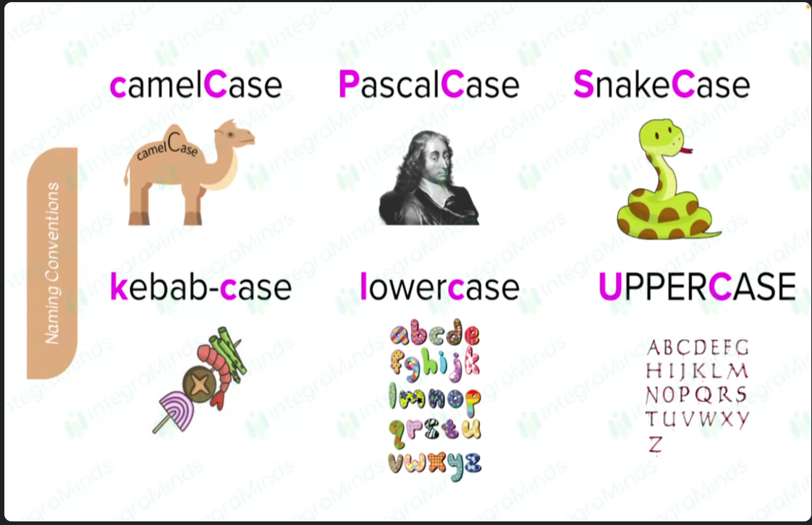
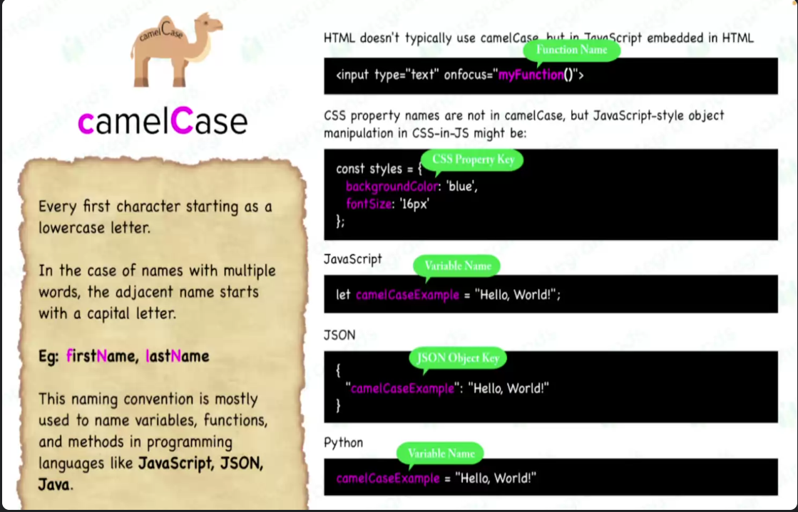

# HTML

- HTML (HyperText Markup Language) is the standard language used to create web pages. It provides the basic structure of a webpage, which is then enhanced and modified by other technologies like CSS (Cascading Style Sheets) and JavaScript. HTML is composed of a series of elements, represented by tags, that tell the web browser how to display the content.

# Headings

# Heading 1

## Heading 2

### Heading 3

#### Heading 4

##### Heading 5

###### Heading 6

**Bold Text**
_Italic Text_
**_Bold and italic Text_**

> Blockquote
> Blockquote
> Blockquote

- List Item 1
- List Item 2
- List Item 3
- List Item 4
- List Item 5
- List Item 6

1. List Item 1
2. List Item 2
   1. Sub List Item 1
   2. Sub List Item 2
3. List Item 3
4. List Item 4

| Column 1 | Column 2 | Column 3 |
| -------- | -------- | -------- |
| Row 1    | Row 1    | Row 1    |
| Row 2    | Row 2    | Row 2    |
| Row 3    | Row 3    | Row 3    |

## Tips

- Element
- Tag

- Whenever Opening Tag/symbol,Immediately close it and come
  inside it to write the content.

Example 1

# CSE

- Section A
  - Section 1
  - Section 2
  - Section 3
- Section B
  - Section 1
  - Section 2
  - Section 3

# User Registration Form

This form allows users to register by providing their personal information.

## Form Fields

1. **First Name**: Required field for the user's first name.
2. **Middle Name**: Optional field for the user's middle name.
3. **Last Name**: Required field for the user's last name.
4. **Email ID**: Required field for the user's email address.
5. **Password**: Required field for creating a password.
6. **Confirm Password**: Required field to confirm the password entered.
7. **Date of Birth**: Required field for the user's date of birth.
8. **Gender**: Required field to select gender from options (Male, Female, Other).
9. **Hobbies**: Optional field to select one or more hobbies from options (Reading, Writing, Listening Music, Watching Movies, Other).
10. **Address**: Required field for the user's address details:
    - House Number
    - Street
    - City
    - State (Dropdown selection)
    - Country (Dropdown selection)
    - Pincode (6-digit numeric entry)
11. **Profile Picture**: Required field to upload a profile picture.
12. **About Me**: Required field for the user to provide a brief description (up to 10 lines) about themselves.
13. **Submit Button**: Button to submit the registration form.

## Usage

1. Fill in all required fields marked with (\*).
2. Select appropriate options from dropdowns where applicable.
3. Upload a profile picture as specified.
4. Click the "Submit" button to complete the registration process.

## Note

- Ensure all information provided is accurate and complete.

# JSON

- "" -> String -> "name": "john"
- [] -> Array -> "name" : ["John","Doe"]
- {} -> Object -> "name" : {"first": "John", "last": "Doe}
- , -> Separator -> "name"
- : -> Key-Value Pair -> "name":"John"

# Truthy

[Truthy](https://developer.mozilla.org/en-US/docs/Glossary/Truthy)

# Falsy

[Falsy](https://developer.mozilla.org/en-US/docs/Glossary/Falsy)

if(0){
console.log("Truthy")}else{console.log("falsy")}

""
"empty"
false
null
undefined
"null"

# CSS

- CSS (Cascading Style Sheets) is a stylesheet language used to control the presentation of HTML documents. It allows you to separate content from design, enabling you to style web pages with colors, fonts, layouts, and more.

# Selectors

# Javascript

- JavaScript is is a versatile, high-level programming language primarily used to create dynamic and interactive content on web pages. It is an essential part of modern web development, allowing developers to manipulate HTML and CSS, handle events, and perform complex operations.

- JavaScript code is typically embedded within HTML documents or included as external files. It is executed in the browser, enabling interaction with the Document Object Model (DOM).

# Data types

# Naming conventions

## camel Case

## Pascal Case

# Array

# **React + Vite**

- Error 1

Failed to resolve import "./XXXXXXX.jsx" from "src/XXX.jsx". Does the file exist?

- Error 2

Unterminated string constant.

- Error 3

Unexpected token (Removed the package name in the import part)

Unexpected token, expected (When the import not properly closed)

- Error 4

Unterminated JSX contents. - When the JSX is not properly closed

- Error 5 :

SyntaxError: The requested module '/src/XXXXXXX' does not provide an export **named** **'default'** (at XXXXXX)

SyntaxError: The requested module '/src/App.jsx?t=1723791975853' does not provide an export **named** **'XXXXXX'**

case 1:

1. Export default with any name and default import any name - > No error
2. Export default with any name and named import any name -> error
3. In a file, only one default export is possible,same only one default import is possible
4. In a file multiple named exports are possible,same multiple name import are possible
5. named export two ways :
   a. export const XXXXXX = () =>{}
   b. const XXXXX = () => {}; export {XXXXXX}

6. Functional component Vs Normal Function
   | Functional Component | Normal Function |
   |---------------------------| ----------------|
   | Always return JSX | Return anything |
   | Pascal Case | Camel Case |
   | 0 or 1 argument ie. props | 0 or more |

7. Functional Components => Normal Function or Arrow Function
8. Functional Components Vs Class Component
